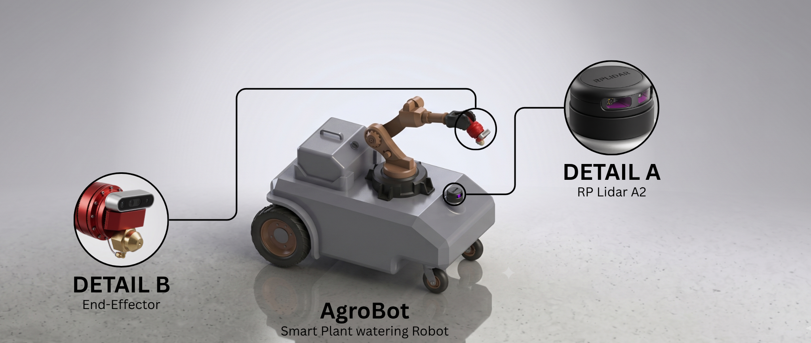
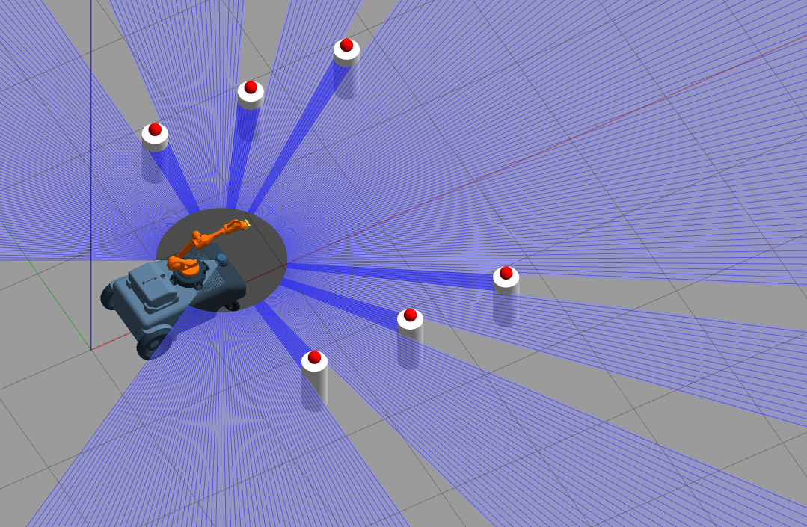
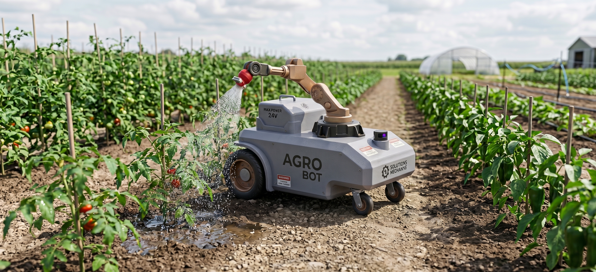
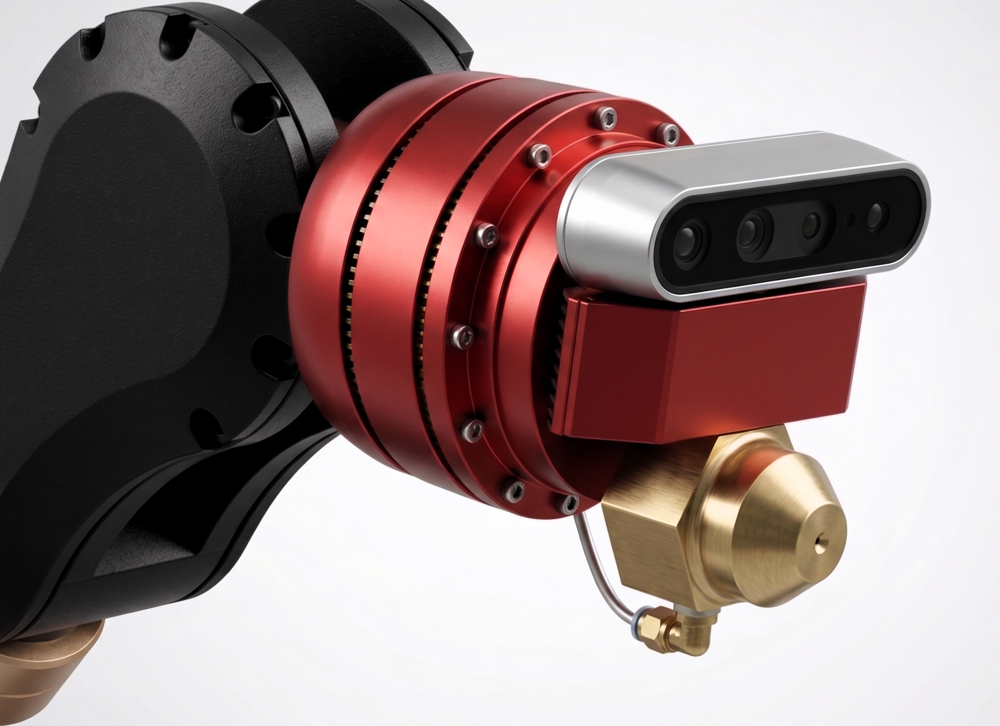
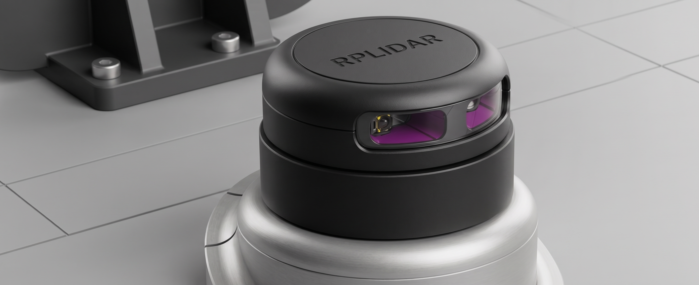
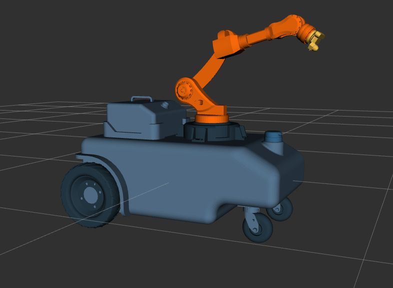
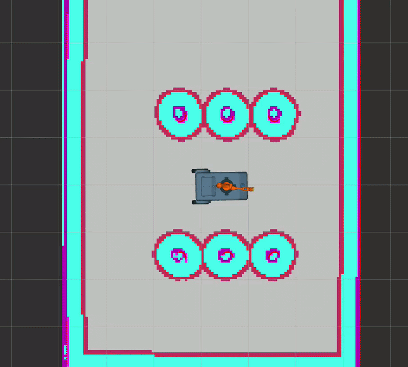
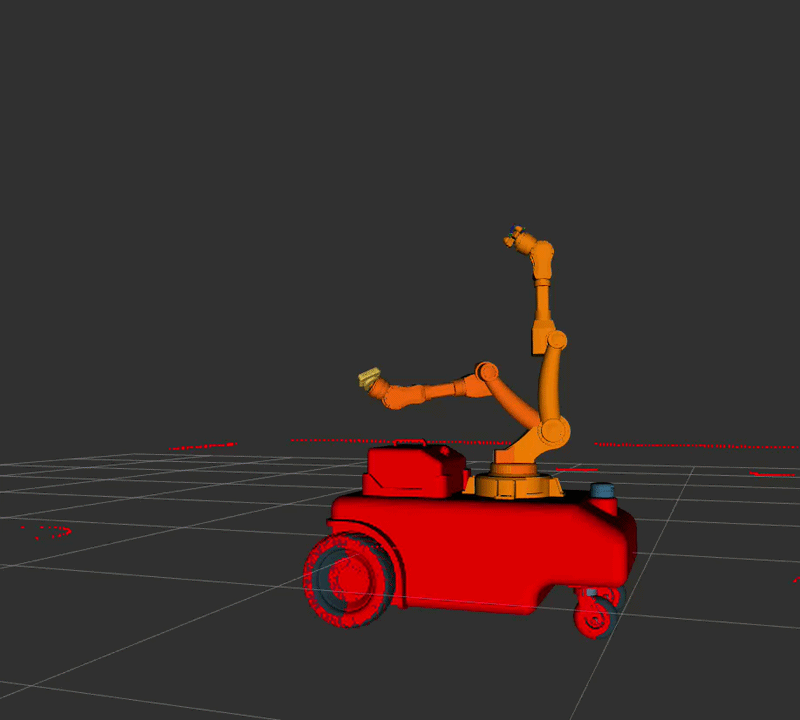
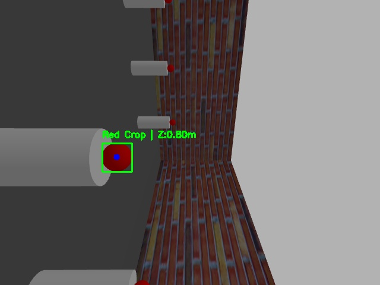

<div align="center">



# Beam AgroBot V2
### Autonomous Precision Agricultural Robot | ROS2 + MoveIt2 + Nav2

[](https://docs.ros.org/en/humble/)
[](https://moveit.ros.org/)
[](LICENSE)
[](https://github.com/xaatim)

</div>

---

## Overview

The Beam AgroBot V2 is a fully autonomous mobile manipulation robot designed for precision agricultural operations. Built on ROS2 Humble, it combines autonomous navigation, a 5-DOF robotic arm, and real-time computer vision to detect and water crops with millimeter-level precision — entirely without human intervention.

This is the simulation-complete version of the AgroBot platform, serving as the research and development foundation before full hardware deployment. The system integrates SLAM-based mapping, Nav2 autonomous navigation, MoveIt2 arm planning with TRAC-IK kinematics, and a depth-camera-based crop detection pipeline.

The AgroBot V2 is a core product of **[Beam Robotics](https://github.com/xaatim/Beam-Command-Center)** — an applied robotics initiative and prospective startup founded by **[Hatim Ahmed Hassan](https://www.linkedin.com/in/hatim-ahmed-713214194)**. Beam Robotics serves as the unified development umbrella for a portfolio of personal engineering projects focused on building advanced autonomous systems for agriculture, infrastructure, and industrial automation.

---

## From V1 to V2

<div align="center">

| | V1 | V2 |
|---|---|---|
| **Navigation** | Manual / teleoperated | Fully autonomous (Nav2 + SLAM) |
| **Arm** | Fixed static arm | 5-DOF manipulator (MoveIt2 + TRAC-IK) |
| **Vision** | RGB camera + YOLO World | RGB-D depth camera + HSV detection |
| **Localization** | None | AMCL + saved map |
| **Framework** | Pure Python + ESP32 | ROS2 Humble full stack |
| **Plant targeting** | Ultrasonic distance | 3D XYZ via camera intrinsics |

</div>

> V1 repository: [Smart-Agricultural-Robot](https://github.com/xaatim/Smart-Agricultural-Robot)

<div align="center">

| V1 Field Prototype | V2 Simulation |
|---|---|
| .jpg) |  |

</div>

---

## System Architecture

The AgroBot V2 is built as a multi-package ROS2 workspace:

```
beam_agrobot_v2/
├── robot_description/     → URDF/Xacro, meshes, materials, sensors
├── robot_navigation/      → Nav2 config, SLAM, AMCL, saved maps
├── robot_vision/          → Crop detection node, plant watering node
├── moveit_config/         → MoveIt2 SRDF, kinematics, OMPL planner
├── media/                 → All renders, simulation screenshots, GIFs
└── models/                → Vision model weights
```

**Full pipeline:**

```
LiDAR → SLAM Toolbox → Map saved
              ↓
        Nav2 + AMCL → Robot navigates to crop row
              ↓
   RGB-D Camera → CropDetectorNode → XYZ position
              ↓
      MoveIt2 + TRAC-IK → Arm plans trajectory
              ↓
         End-Effector reaches plant → Watering triggered
```

---

## Hardware Design

<div align="center">



</div>

The AgroBot V2 chassis was designed from scratch in SolidWorks, optimized for agricultural terrain and modular maintenance.

**Key design decisions:**

- **Differential drive** — 2 large rear drive wheels + 1 front caster roller. Enables tight U-turns at crop row ends for boustrophedon path coverage
- **Removable water tank** — dedicated tank holder bracket bolted to chassis frame. Tank lifts out for refilling without disturbing any electronics or arm mounting
- **Arm mounted on chassis frame directly** — not on the tank. All arm torque loads go into the main structural frame
- **Front-mounted arm** — arm leads the robot as it moves forward down the crop row, detecting and watering before the body passes

<div align="center">

| End-Effector | RPLiDAR A2 |
|---|---|
|  |  |

</div>

**End-Effector:**
The end-effector integrates an Intel RealSense D435 depth camera and a brass precision nozzle on a single custom mount. Eye-in-hand placement ensures the detection frame and the dosing point are always aligned — no offset calculation needed.

---

## Simulation

<div align="center">



</div>

**Autonomous Navigation (Nav2)**



The robot uses SLAM Toolbox to build a map of the environment on the first run. On subsequent runs, Nav2 localizes using AMCL against the saved map and navigates to waypoints autonomously. The costmap inflates around obstacles to ensure the chassis and arm clear all objects during navigation.

**Arm Control (MoveIt2)**



The 5-DOF arm is controlled via MoveIt2 with the TRAC-IK kinematics solver. TRAC-IK was chosen over the default KDL solver for its significantly higher success rate on difficult configurations near joint limits. The arm receives 3D Cartesian goals and plans collision-free trajectories using the OMPL planner.

---

## Crop Detection

<div align="center">



</div>

The `CropDetectorNode` uses synchronized RGB and depth image streams from the RealSense camera to locate and target plants. 

**Simulation vs. Real-World Pipeline:**
* **Simulation (Gazebo):** For testing kinematics and navigation in Gazebo, the crops are represented as red spheres. The node utilizes an HSV color-space mask to reliably isolate these placeholders, filtering contours by area and circularity to reject background geometry.
* **Real-World (Hardware):** The core field pipeline replaces the basic HSV filter with a **YOLO-based deep learning model** (e.g., YOLOv8). This allows the robot to accurately classify and draw bounding boxes around specific real-world crops (like tomatoes or strawberries), distinguishing the fruit from complex foliage and stems under variable outdoor lighting.

For each valid detection (whether a simulated sphere or a YOLO bounding box), the node calculates the centroid pixel and back-projects it to a 3D point in camera space using the camera intrinsic parameters:

```text
X = (u - cx) * Z / fx
Y = (v - cy) * Z / fy

---

## Roadmap & Hardware Evolution

### V2 — Current (Simulation Complete)
- [x] Full SolidWorks chassis design (900mm length)
- [x] URDF/Xacro with Gazebo plugins
- [x] ROS2 Control + differential drive controller
- [x] SLAM Toolbox mapping
- [x] Nav2 autonomous navigation
- [x] MoveIt2 + TRAC-IK arm control
- [x] RGB-D crop detection with 3D localization
- [x] Gazebo simulation world with crop targets
- [ ] Full pipeline integration (Nav2 → detect → arm → water)
- [ ] Beam Command Center dashboard integration

### V3 — Advanced Systems & Fleet Monitoring (In Development)
- [ ] **GPS/GNSS Integration:** For precise global tracking across large outdoor agricultural fields.
- [ ] **Battery SOC Monitoring:** Real-time State of Charge tracking with autonomous return-to-base charging capabilities.
- [ ] Multi-robot namespace architecture
- [ ] Boustrophedon path planning (full row coverage)
- [ ] Inter-robot task allocation and fleet monitoring on Beam Command Center
- [ ] Auto-mapping on first run (exploration behavior)

### V4 — Hardware Overhaul & Field Deployment
- [ ] **Drivetrain Upgrade (Tank Treads):** Transitioning from differential castors to continuous tank treads to distribute the 234kg weight, allowing seamless traversal over mud soft soil and zero-degree spin-in-place turns inside tight crop rows.
- [ ] **Arm Upgrade (6-DOF):** Upgrading the manipulator from 5-DOF to 6-DOF to allow complex nozzle orientations (e.g., spraying upwards underneath leaves).
- [ ] **Vision Upgrade:** Adding a static, mast-mounted global depth camera to complement the eye-in-hand RealSense camera, preventing foliage from blocking the Field of View.
- [ ] Real hardware build and assembly
- [ ] ROS2 Control hardware interface mapping
- [ ] Field testing, calibration, and Beam Command Center live integration

---

## Software Stack

| Component | Technology |
|---|---|
| Framework | ROS2 Humble |
| Simulation | Gazebo Classic |
| Navigation | Nav2 + AMCL |
| Mapping | SLAM Toolbox |
| Arm Planning | MoveIt2 |
| Kinematics | TRAC-IK |
| Motion Planning | OMPL |
| Computer Vision | OpenCV + cv_bridge |
| Depth Processing | Intel RealSense ROS2 |
| Robot Description | URDF + Xacro |
| Control | ros2_control + diff_drive_controller |

---

## Getting Started

**Prerequisites:**
- Ubuntu 22.04
- ROS2 Humble
- Gazebo Classic
- MoveIt2 Humble
- Nav2 Humble

**Build:**
```bash
git clone https://github.com/xaatim/Beam-AgroBot-V2.git
cd Beam-AgroBot-V2
rosdep install --from-paths src --ignore-src -r -y
colcon build
source install/setup.bash
```

**Launch simulation:**
```bash
# Launch Gazebo world with robot
ros2 launch robot_description gazebo.launch.py

# Launch Nav2 with saved map
ros2 launch robot_navigation navigation.launch.py

# Launch MoveIt2
ros2 launch moveit_config moveit.launch.py

# Launch crop detection
ros2 run robot_vision crop_detector_node
```

---

## Beam Robotics Ecosystem

The AgroBot V2 is registered and monitored through the **Beam Command Center** — a centralized platform for managing all Beam Robotics products. Each unit is paired via a cryptographic serial key and streams operational data including camera feed, watering logs, water level, battery health, and location to the operator dashboard.

**Other Beam Robotics products:**
- [Smart Agricultural Robot V1](https://github.com/xaatim/Smart-Agricultural-Robot) — field-tested precision dosing prototype
- [Beam Access Control System](https://github.com/xaatim/SmartAccessControl) — biometric access, license plate recognition, surveillance
- [Beam Surveillance Bot](https://github.com/xaatim/Autonomous_security_robot) — autonomous patrol robot with face recognition

---

## Author

**Hatim Ahmed Hassan**
Lead Engineer & Founder, Beam Robotics

[](https://github.com/xaatim)

---

*Licensed under the MIT License*
